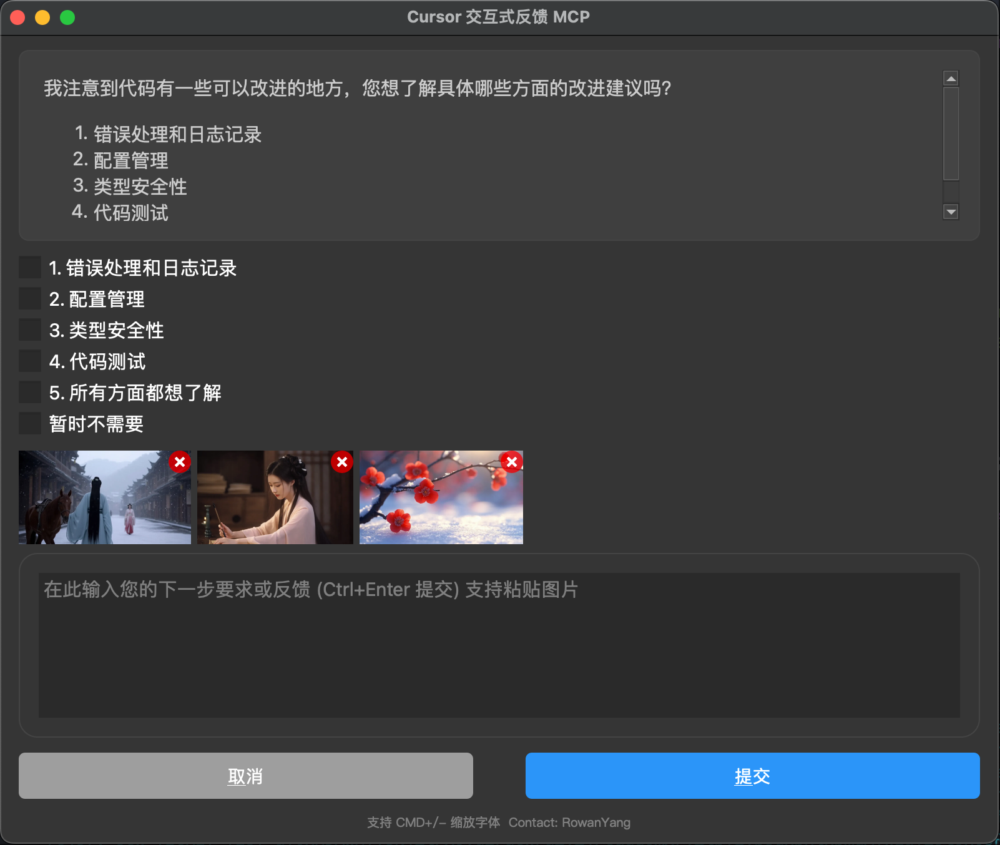

# 🗣️ Interactive Feedback MCP

[中文文档](./README.zh-CN.md)

Simple [MCP Server](https://modelcontextprotocol.io/) to enable a human-in-the-loop workflow in AI-assisted development tools like [Cursor](https://www.cursor.com), [Cline](https://cline.bot) and [Windsurf](https://windsurf.com). This server allows you to easily provide feedback directly to the AI agent, bridging the gap between AI and you.

**Note:** This server is designed to run locally alongside the MCP client (e.g., Claude Desktop, VS Code), as it needs direct access to the user's operating system to display notifications.

## New Features

- Beautiful UI
- Support pasting images
- Support markdown format

## 🖼️ Example



## 💡 Why Use This?

In environments like Cursor, every prompt you send to the LLM is treated as a distinct request — and each one counts against your monthly limit (e.g. 500 premium requests). This becomes inefficient when you're iterating on vague instructions or correcting misunderstood output, as each follow-up clarification triggers a full new request.

This MCP server introduces a workaround: it allows the model to pause and request clarification before finalizing the response. Instead of completing the request, the model triggers a tool call (`interactive_feedback`) that opens an interactive feedback window. You can then provide more detail or ask for changes — and the model continues the session, all within a single request.

Under the hood, it's just a clever use of tool calls to defer the completion of the request. Since tool calls don't count as separate premium interactions, you can loop through multiple feedback cycles without consuming additional requests.

Essentially, this helps your AI assistant _ask for clarification instead of guessing_, without wasting another request. That means fewer wrong answers, better performance, and less wasted API usage.

- **💰 Reduced Premium API Calls:** Avoid wasting expensive API calls generating code based on guesswork.
- **✅ Fewer Errors:** Clarification \_before\_ action means less incorrect code and wasted time.
- **⏱️ Faster Cycles:** Quick confirmations beat debugging wrong guesses.
- **🎮 Better Collaboration:** Turns one-way instructions into a dialogue, keeping you in control.

## 🛠️ Tools

This server exposes the following tool via the Model Context Protocol (MCP):

- `interactive_feedback`: Asks the user a question and returns their answer. Can display predefined options.

## 📦 Installation

1.  **Prerequisites:**
    - Python 3.10+
    - [uv](https://github.com/astral-sh/uv) (Python package manager). Install it with:
      - Windows: `pip install uv`
      - Linux: `curl -LsSf https://astral.sh/uv/install.sh | sh`
      - macOS: `brew install uv`
2.  **Get the code:**
    - Clone this repository:
      `git clone https://github.com/kele527/interactive-feedback-mcp.git`
    - Or download the source code.

## ⚙️ Configuration

1. Add the following configuration to your `claude_desktop_config.json` (Claude Desktop) or `mcp.json` (Cursor):
   **Remember to change the `/path/to/interactive-feedback-mcp` path to the actual path where you cloned the repository on your system.**

```json
{
  "mcpServers": {
    "interactive-feedback": {
      "command": "uv",
      "args": ["--directory", "/path/to/interactive-feedback-mcp", "run", "server.py"],
      "timeout": 600,
      "autoApprove": ["interactive_feedback"]
    }
  }
}
```

2. Add the following to the custom rules in your AI assistant (in Cursor Settings > Rules > User Rules):

> If requirements or instructions are unclear use the tool interactive_feedback to ask clarifying questions to the user before proceeding, do not make assumptions. Whenever possible, present the user with predefined options through the interactive_feedback MCP tool to facilitate quick decisions.

> Whenever you're about to complete a user request, call the interactive_feedback tool to request user feedback before ending the process. If the feedback is empty you can end the request and don't call the tool in loop.

This will ensure your AI assistant always uses this MCP server to request user feedback when the prompt is unclear and before marking the task as completed.

## 🙏 Acknowledgements

Developed by Fábio Ferreira ([@fabiomlferreira](https://x.com/fabiomlferreira)).

Enhanced by Pau Oliva ([@pof](https://x.com/pof)) with ideas from Tommy Tong's [interactive-mcp](https://github.com/ttommyth/interactive-mcp).

UI Optimized by kele527 ([@kele527](https://x.com/jasonya76775253))
