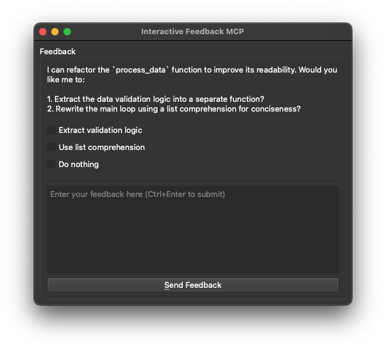

# 🗣️ Interactive Feedback MCP: Bridging the Gap Between AI and You!

Simple [MCP Server](https://modelcontextprotocol.io/) to enable a human-in-the-loop workflow in AI-assisted development tools like [Cursor](https://www.cursor.com), [Cline](https://cline.bot) and [Windsurf](https://windsurf.com).

This server allows you to easily provide feedback directly to the AI agent.

 **Note:** This server is designed to run locally alongside the MCP client (e.g., Claude Desktop, VS Code), as it needs direct access to the user's operating system to display notifications.

## 🖼️ Example



## 💡 Why Use This?
By enabling your AI to simply ask for clarification or direction, this module dramatically reduces wasted resources on platforms like Cursor. In some cases, it helps consolidate multiple tool calls or premium requests into a single, feedback-aware request — saving resources and improving performance.

## 🚀 Usage Scenarios

This server is ideal for scenarios where an LLM needs to interact directly with the user on their local machine, such as:

- Interactive setup or configuration processes.
- Gathering feedback during code generation or modification.
- Clarifying instructions or confirming actions in pair programming.
- Any workflow requiring user input or confirmation during LLM operation.

## 🛠️ Tools

This server exposes the following tool via the Model Context Protocol (MCP):

- `interactive_feedback`: Asks the user a question and returns their answer. Can display predefined options.

## 📦 Installation

1.  **Prerequisites:**
    *   Python 3.11 or newer.
    *   [uv](https://github.com/astral-sh/uv) (Python package manager). Install it with:
        *   Windows: `pip install uv`
        *   Linux: `curl -LsSf https://astral.sh/uv/install.sh | sh`
        *   macOS: `brew install uv`
2.  **Get the code:**
    *   Clone this repository:
        `git clone https://github.com/pauoliva/interactive-feedback-mcp.git`
    *   Or download the source code.

## ⚙️ Configuration

1. Add the following configuration to your `claude_desktop_config.json` (Claude Desktop) or `mcp.json` (Cursor):
**Remember to change the `/path/to/interactive-feedback-mcp` path to the actual path where you cloned the repository on your system.**
```json
{
  "mcpServers": {
    "interactive-feedback": {
      "command": "uv",
      "args": [
        "--directory",
        "/path/to/interactive-feedback-mcp",
        "run",
        "server.py"
      ],
      "timeout": 600,
      "autoApprove": [
        "interactive_feedback"
      ]
    }
  }
}
```
2. Add the following to the custom rules in your AI assistant (in Cursor Settings > Rules > User Rules):

> If requirements or instructions are unclear use the tool interactive_feedback to ask clarifying questions to the user before proceeding, do not make assumptions. Whenever possible, present the user with predefined options through the interactive_feedback MCP tool to facilitate quick decisions.
> Whenever you're about to complete a user request, call the interactive_feedback tool to request user feedback before ending the process. If the feedback is empty you can end the request and don't call the tool in loop.

This will ensure your AI assistant always uses this MCP server to request user feedback when the prompt is unclear and before marking the task as completed.

## 🙏 Acknowledgements

Developed by Fábio Ferreira ([@fabiomlferreira](https://x.com/fabiomlferreira)).

Enhanced by Pau Oliva ([@pof](https://x.com/pof)) with ideas from Tommy Tong's [interactive-mcp](https://github.com/ttommyth/interactive-mcp).