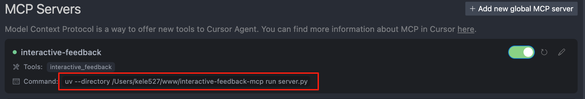

# 🗣️ 交互式反馈 MCP

一个简单的 [MCP 服务器](https://modelcontextprotocol.io/)，可以在 [Cursor](https://www.cursor.com)、[Cline](https://cline.bot) 和 [Windsurf](https://windsurf.com) 等 AI 辅助开发工具中启用人机协作（human-in-the-loop）的工作流程。该服务器允许您直接向 AI 代理提供反馈，弥合了 AI 与您之间的差距。

**注意：** 该服务器设计为与 MCP 客户端（例如 Claude Desktop、VS Code）一起在本地运行，因为它需要直接访问用户的操作系统以显示通知。

## 新增功能

- 美化了弹框样式
- 支持粘贴图片
- 支持 markdown 格式

## 🖼️ 示例


## 💡 为什么使用这个？

在 Cursor 这样的环境中，您发送给 LLM 的每一个提示都被视为一个独立请求——每个请求都会计入您的月度限额（例如 500 个高级请求）。当您根据模糊的指令进行迭代或纠正误解的输出时，这会变得低效，因为每个后续澄清都会触发一个全新的请求。

这个 MCP 服务器引入了一个解决方案：它允许模型在最终确定响应之前暂停并请求澄清。模型不会完成请求，而是触发一个工具调用 (`interactive_feedback`)，该调用会打开一个交互式反馈窗口。然后，您可以提供更多细节或要求更改——模型将继续会话，所有这些都在单个请求中完成。

其本质上，这只是巧妙地利用工具调用来延迟请求的完成。由于工具调用不计为单独的高级交互，因此您可以在不消耗额外请求的情况下循环进行多个反馈周期。

本质上，这有助于您的 AI 助手**寻求澄清而不是猜测**，而不会浪费另一个请求。这意味着更少的错误答案、更好的性能和更少的 API 使用浪费。

- **💰 减少高级 API 调用：** 避免浪费昂贵的 API 调用来根据猜测生成代码。
- **✅ 更少错误：** **在**行动之前进行澄清意味着更少的错误代码和浪费的时间。
- **⏱️ 更快的周期：** 快速确认胜过调试错误的猜测。
- **🎮 更好的协作：** 将单向指令变成对话，让您保持控制。

## 🛠️ 工具

该服务器通过模型上下文协议 (MCP) 暴露了以下工具：

- `interactive_feedback`：向用户提问并返回用户的答案。可以显示预设选项。

## 📦 安装

1.  **先决条件：**
    - Python 3.11 或更新版本。
    - [uv](https://github.com/astral-sh/uv) (Python 包管理器)。使用以下命令安装：
      - Windows: `pip install uv`
      - Linux: `curl -LsSf https://astral.sh/uv/install.sh | sh`
      - macOS: `brew install uv`
2.  **获取代码：**
    - 克隆此仓库：
      `git clone https://github.com/pauoliva/interactive-feedback-mcp.git`
    - 或下载源代码。

## ⚙️ 配置

1. 在您的 `claude_desktop_config.json` (Claude Desktop) 或 `mcp.json` (Cursor) 中添加以下配置：
   **请记住将 `/path/to/interactive-feedback-mcp` 路径更改为您系统中克隆仓库的实际路径。**

```json
{
  "mcpServers": {
    "interactive-feedback": {
      "command": "uv",
      "args": ["--directory", "/path/to/interactive-feedback-mcp", "run", "server.py"],
      "timeout": 600,
      "autoApprove": ["interactive_feedback"]
    }
  }
}
```

如果无法成功启动，复制下图中的命令，在终端中执行，看看报什么错误，一般是 python 安装相关。



2. 在您的 AI 助手（在 Cursor Settings > Rules > User Rules 中）的自定义规则中添加以下内容：

> 如果需求或指示不明确，请使用 interactive_feedback 工具向用户询问澄清问题，不要做出假设。如果可能，通过 interactive_feedback MCP 工具向用户提供预设选项以方便快速决策。

> 每当您即将完成用户请求时，调用 interactive_feedback 工具请求用户反馈，然后再结束流程。如果反馈为空，您可以结束请求并且不要循环调用该工具。

这将确保您的 AI 助手在提示不明确时以及在将任务标记为完成之前始终使用此 MCP 服务器来请求用户反馈。

## 🙏 致谢

由 Fábio Ferreira ([@fabiomlferreira](https://x.com/fabiomlferreira)) 开发。

由 Pau Oliva ([@pof](https://x.com/pof)) 在 Tommy Tong 的 [interactive-mcp](https://github.com/ttommyth/interactive-mcp) 的启发下进行了增强。

用户界面由 kele527 ([@kele527](https://x.com/jasonya76775253)) 优化
