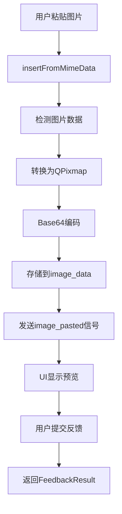

# 📸 Interactive Feedback MCP - 图片功能产品需求文档 (PRD)

## 📋 文档信息
- **版本**: v1.0
- **创建日期**: 2024年12月
- **最后更新**: 2024年12月
- **负责人**: AI Assistant
- **状态**: 设计阶段

---

## 🎯 产品概述

### 功能定位
Interactive Feedback MCP 的图片功能旨在为用户提供直观、高效的图片分享和反馈能力，支持用户通过粘贴图片的方式向 Cursor 传递视觉信息，增强人机交互的表达能力。

### 核心价值
- **🖼️ 视觉化交流**: 支持用户通过图片传递复杂的视觉信息
- **🚀 无缝集成**: 与现有文本反馈系统完美融合
- **⚡ 高效传输**: 基于Base64编码的图片数据传输
- **🎨 用户友好**: 直观的图片预览和管理界面

---

## 🔧 技术架构

### 核心组件

#### 1. FeedbackTextEdit 类
**职责**: 图片输入和处理的核心组件

```python
class FeedbackTextEdit(QTextEdit):
    # 图片处理常量
    DEFAULT_MAX_IMAGE_WIDTH = 1624
    DEFAULT_MAX_IMAGE_HEIGHT = 1624
    DEFAULT_IMAGE_FORMAT = "PNG"
    
    # 信号定义
    image_pasted = Signal(QPixmap)
```

**关键特性**:
- 支持剪贴板图片粘贴
- 自动图片格式转换
- Base64编码处理
- 高DPI屏幕支持

#### 2. 图片数据结构
```python
class FeedbackResult(TypedDict):
    interactive_feedback: str
    images: List[str]  # Base64编码的图片数据列表
```

### 数据流程



---

## 🎨 用户界面设计

### 图片预览区域

#### 布局位置
- **位置**: 中间栏（智能推荐选项面板）
- **排列**: 位于智能推荐选项列表的最后面
- **集成方式**: 与选项列表无缝集成，保持一致的视觉风格

#### 布局规范
- **容器高度**: 80px 固定高度
- **图片间距**: 5px
- **内边距**: 5px (上下左右)
- **对齐方式**: 左对齐，垂直居中
- **滚动支持**: 水平滚动查看多张图片
- **显示逻辑**: 仅在有图片时显示，无图片时隐藏

#### 图片显示规则
```python
# 缩放算法
target_height = 80  # 固定高度
scaled_width = int(original_width * (target_height / original_height))

# 保持宽高比缩放
scaled_pixmap = pixmap.scaled(
    scaled_width,
    target_height,
    Qt.KeepAspectRatio,
    Qt.SmoothTransformation
)
```

#### 删除按钮设计
- **位置**: 图片右上角悬浮
- **尺寸**: 18x18px
- **样式**: 红色圆形背景，白色"×"符号
- **交互**: 悬停时背景变为纯红色

### 响应式设计

#### 高DPI屏幕支持
```python
device_pixel_ratio = QApplication.primaryScreen().devicePixelRatio()
if device_pixel_ratio > 1.0:
    # 创建高分辨率pixmap
    hires_pixmap = pixmap.scaled(
        hires_scaled_width,
        hires_target_height,
        Qt.KeepAspectRatio,
        Qt.SmoothTransformation
    )
    hires_pixmap.setDevicePixelRatio(device_pixel_ratio)
```

---

## ⚙️ 功能规格

### 图片输入功能

#### 支持的输入方式
1. **剪贴板粘贴** (主要方式)
   - 快捷键: `Ctrl+V` / `Cmd+V`
   - 支持从任何应用程序复制的图片
   - 自动检测MIME数据中的图片内容

#### 支持的图片格式
- **输入格式**: 所有QPixmap支持的格式
  - PNG, JPEG, BMP, GIF, TIFF等
- **输出格式**: PNG (统一转换)
- **编码方式**: Base64字符串

#### 图片处理规格
```python
# 图片转换参数
DEFAULT_MAX_IMAGE_WIDTH = 1624   # 最大宽度
DEFAULT_MAX_IMAGE_HEIGHT = 1624  # 最大高度
DEFAULT_IMAGE_FORMAT = "PNG"     # 输出格式
```

### 图片管理功能

#### 图片预览功能
- **实时预览**: 图片粘贴后立即在中间栏显示预览
- **缩略图显示**: 按比例缩放到80px高度，保持宽高比
- **多图片支持**: 支持多张图片的水平排列显示
- **预览质量**: 高清预览，支持高DPI屏幕显示

#### 图片存储
```python
image_info = {
    'base64': image_result['data'],      # Base64编码数据
    'filename': filename                 # 生成的唯一文件名
}
```

#### 文件名生成规则
```python
timestamp = datetime.now().strftime("%Y%m%d_%H%M%S")
unique_id = str(uuid.uuid4())[:8]
filename = f"pasted_image_{timestamp}_{unique_id}.{extension}"
```

#### 图片删除功能
- **触发方式**: 点击图片右上角删除按钮
- **删除范围**: 
  - 从UI预览区域移除
  - 从image_data列表中删除
  - 释放相关内存资源
- **自动隐藏**: 当所有图片被删除时，自动隐藏预览容器

#### 中间栏集成设计
```python
# 在中间栏布局中添加图片预览区域
def _create_center_panel(self):
    # ... 智能推荐选项 ...
    
    # 图片预览区域 - 位于选项列表最后
    self.images_container = QFrame()
    self.images_container.setStyleSheet("""
        QFrame {
            background: rgba(255, 255, 255, 0.05);
            border: 1px solid rgba(255, 255, 255, 0.1);
            border-radius: 8px;
            margin: 5px 0px;
        }
    """)
    self.images_container.setFixedHeight(90)  # 包含边距的总高度
    self.images_container.setVisible(False)  # 默认隐藏
    
    layout.addWidget(self.images_container)
```

---

## 🔄 数据传输

### 输出数据格式

#### FeedbackResult结构
```python
{
    "interactive_feedback": "用户的文本反馈内容",
    "images": [
        "iVBORw0KGgoAAAANSUhEUgAA...",  # Base64编码的图片1
        "iVBORw0KGgoAAAANSUhEUgAA...",  # Base64编码的图片2
        # ... 更多图片
    ]
}
```

#### 与Cursor的集成
- **传输方式**: JSON格式数据
- **图片编码**: Base64字符串数组
- **文本结合**: 图片与文本反馈同时传输
- **顺序保持**: 图片按粘贴顺序排列

---

## 🎯 用户体验设计

### 交互流程

#### 标准使用流程
1. **图片粘贴**
   - 用户在其他应用中复制图片
   - 在左侧消息内容的文本框中按 `Ctrl+V`
   - 系统自动检测并处理图片

2. **图片预览**
   - 中间栏的图片预览区域自动显示
   - 图片按粘贴顺序从左到右排列
   - 位于智能推荐选项列表的最后面
   - 支持水平滚动查看多张图片

3. **图片管理**
   - 悬停显示删除按钮
   - 点击删除不需要的图片
   - 实时更新中间栏预览区域
   - 无图片时自动隐藏预览区域

4. **反馈提交**
   - 图片自动包含在反馈结果中
   - 与文本内容和选择的选项一起发送给Cursor

### 视觉反馈

#### 状态指示
- **空状态**: 中间栏预览区域隐藏，不影响选项列表布局
- **有图片**: 中间栏预览区域显示在选项列表最后，图片左对齐
- **悬停状态**: 删除按钮高亮显示，与毛玻璃主题一致
- **删除动画**: 图片移除时的平滑过渡，保持界面流畅性
- **集成状态**: 预览区域与智能推荐选项保持一致的视觉风格

#### 错误处理
```python
try:
    # 图片处理逻辑
except Exception as e:
    print(f"处理图片时出错: {e}")
    cursor.insertText(f"[图片处理失败: {str(e)}]")
```

---

## 🚀 性能优化

### 内存管理
- **即时编码**: 图片粘贴后立即转换为Base64
- **原图释放**: 转换完成后释放原始QPixmap
- **删除清理**: 图片删除时及时释放内存

### 渲染优化
- **缩放缓存**: 预览图片使用缓存的缩放版本
- **高DPI适配**: 根据屏幕像素比动态调整
- **平滑缩放**: 使用Qt.SmoothTransformation

### 传输优化
- **格式统一**: 统一转换为PNG格式
- **压缩平衡**: 在质量和大小间找到平衡
- **批量传输**: 多张图片一次性传输

---

## 🔒 技术限制

### 当前限制
1. **图片尺寸**: 最大1624x1624像素
2. **数量限制**: 无硬性限制，但受内存约束
3. **格式支持**: 依赖Qt支持的格式
4. **输入方式**: 仅支持剪贴板粘贴

### 浏览器兼容性
- **桌面应用**: 基于PySide6，无浏览器依赖
- **跨平台**: 支持Windows、macOS、Linux

---

## 📈 未来扩展

### 计划功能
1. **拖拽支持**: 支持文件拖拽到中间栏预览区域
2. **文件选择**: 在中间栏添加文件选择按钮
3. **图片编辑**: 基础的裁剪、旋转功能
4. **格式选择**: 用户可选择输出格式
5. **压缩设置**: 可调节的图片质量设置
6. **预览增强**: 支持图片放大查看功能
7. **批量操作**: 中间栏支持批量图片管理

### 技术改进
1. **异步处理**: 大图片的异步转换
2. **进度指示**: 处理进度的可视化反馈
3. **批量操作**: 多图片的批量管理
4. **云端存储**: 可选的云端图片存储

---

## 🧪 测试策略

### 功能测试
- **图片粘贴**: 各种格式图片的粘贴测试
- **预览显示**: 不同尺寸图片的显示效果
- **删除功能**: 图片删除的完整性测试
- **数据传输**: Base64编码的正确性验证

### 性能测试
- **内存使用**: 多图片场景下的内存占用
- **响应速度**: 图片处理的响应时间
- **高DPI测试**: 不同像素比屏幕的显示效果

### 兼容性测试
- **操作系统**: Windows、macOS、Linux
- **屏幕分辨率**: 不同分辨率和DPI设置
- **图片来源**: 不同应用程序复制的图片

---

## 📊 成功指标

### 用户体验指标
- **粘贴成功率**: >99%
- **预览加载时间**: <500ms
- **删除响应时间**: <100ms
- **内存使用效率**: 单张图片<10MB内存占用

### 技术指标
- **Base64转换准确率**: 100%
- **高DPI适配覆盖率**: 100%
- **错误处理覆盖率**: >95%
- **跨平台兼容性**: 100%

---

## 🔧 实现细节

### 关键代码片段

#### 图片粘贴处理
```python
def insertFromMimeData(self, source_data):
    if source_data.hasImage():
        image = source_data.imageData()
        if image:
            image_result = self._convert_image_to_base64(image)
            if image_result:
                # 生成文件名并保存
                timestamp = datetime.now().strftime("%Y%m%d_%H%M%S")
                unique_id = str(uuid.uuid4())[:8]
                filename = f"pasted_image_{timestamp}_{unique_id}.{image_result['extension']}"
                
                image_info = {
                    'base64': image_result['data'],
                    'filename': filename
                }
                self.image_data.append(image_info)
                self.image_pasted.emit(pixmap)
```

#### Base64转换
```python
def _convert_image_to_base64(self, image):
    if not isinstance(image, QPixmap):
        pixmap = QPixmap.fromImage(image)
    else:
        pixmap = image
    
    buffer = QBuffer()
    buffer.open(QIODevice.WriteOnly)
    pixmap.save(buffer, self.image_format)
    
    byte_array = buffer.data()
    base64_string = base64.b64encode(byte_array).decode('utf-8')
    buffer.close()
    
    return {
        'data': base64_string,
        'extension': self.image_format.lower()
    }
```

---

## 📝 总结

Interactive Feedback MCP 的图片功能为用户提供了强大而直观的视觉交流能力。通过将图片预览功能集成到中间栏的智能推荐选项区域，实现了功能的无缝整合和界面的统一性。

### 🎯 核心优势
- **🎨 界面统一**: 图片预览与智能推荐选项保持一致的毛玻璃视觉风格
- **📍 位置优化**: 中间栏布局让图片预览更加直观和易于管理
- **⚡ 实时反馈**: 图片粘贴后立即在中间栏显示，提供即时的视觉确认
- **🔄 智能隐藏**: 无图片时自动隐藏，不影响正常的选项列表布局

### 🚀 技术创新
通过精心设计的用户界面和高效的数据处理机制，用户可以轻松地将图片信息传递给 Cursor，大大增强了人机交互的表达能力和效率。中间栏的集成设计既保持了界面的简洁性，又提供了强大的图片管理功能。

该功能的成功实现为未来更多视觉化交互功能奠定了坚实的技术基础，是 Interactive Feedback MCP 产品生态中的重要组成部分。 